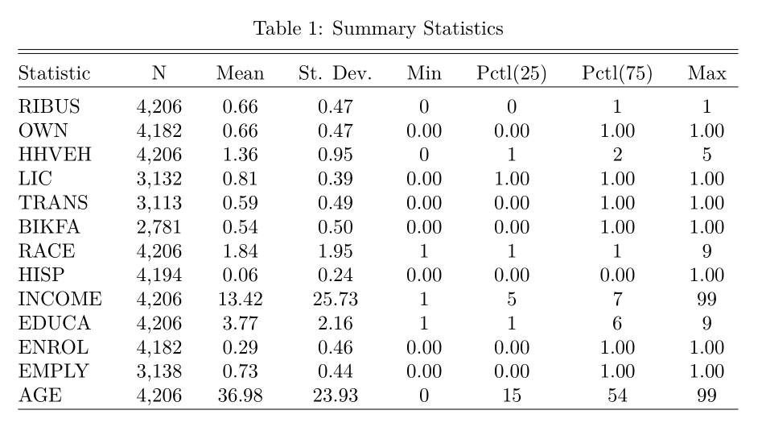

```{r setup, echo = F, message = F}
knitr::opts_chunk$set(results = 'asis', cache = F)
library(tidyverse)
library(summarytools) 


```

# Introduction

Despite Boston's expansive MBTA system, some more residential neighborhoods demonstrate a surprising lack of transit access. In the Allston-Brighton area, residents have reported discomforting crowding on bus lines. The 66 bus, which primarily services Allston, comes in 2nd for highest weekly ridership for and MBTA buses. The 66, as well as the 47,57, and 64, all report relatively low satisfaction rates (Allston Early Action Transit Study). 
	
Due to these issues that have existed within the Allston-Brighton community, the city of Boston is currently conducting research for transit and transportation infrastructure improvements through the Allston-Brighton Mobility Study and Allston Early Action Transit Study. In 2016, 1,170,000 square feet of new development was approved for this neighborhood and the ongoing nature of this project renders the objective of this paper relevant and useful (Allston Early Action Transit Study). 

With the ongoing efforts to better Allston-Brighton’s public transit, this project invokes the question of who these new developments will serve. This paper aims to examine which residents are frequently using public transit and which are not. Our research question asks what the effect of homeownership is on one’s transit use habits within Allston-Brighton. The dynamics of this neighborhood are particular in that Allston-Brighton has been experiencing a newer influx of residents and is rapidly growing, which is a lot of why there is a need to expand transit. These residents who come to Allston-Brighton are often renters and exist more temporarily within the community. Homeowners hold a more permanent commitment to the community and this paper aims to use homeownership as means of determining whether the transit system more so serves the temporary community (renters) or the more permanent community (homeowners), acknowledging the imperfect proxy of homeownership as means of permanent community membership. To find the correlation coefficients, we used data from the Massachusetts Travel Survey of 2010-2011 to run a linear regression of an indicator variable for “regularly uses public transit” on an indicator variable for homeownership. To control for external explanatory variables, we ran seven regression to test the effects of varying outside effects. By and large, the regression found that homeowners in Allston-Brighton are statistically less likely to use public transit regularly than renters. These findings can be used to look more deeply into who to cater more to in the expansion of transit (transit riders) and who to cater to with road infrastructure expansion (Drivers, cyclists, etc.).

# Literature Review

Similar studies have been conducted to examine determinants of transit use, demonstrating a clear curiosity and establishing the topic as one worth exploring. However, many of these examine more general phenomena on broader audiences. Michael Manville and Adam Seth Levine examine various frames, each of which represent a reason to support public transit, in their paper What motivates public support for public transit? Paying close attention to the “reduces congestion” frame, the study found through an experimental survey that Manville and Levine’s hypothesis was supported that individuals, when dealing with issues of traffic congestion along with other infrastructural issues, will generally support public transit. While this work breaks down support for transit based on an individual’s views through a policy lens, it does not look at demography in terms of determinants of transit use or support. There has also been a surprisingly small amount of literature done on determinants of transit use that examine demography and public transit use. Most of this work  is done through small and large scale demographic surveys that are not published as papers  Little to none look at homeownership in the way that this paper examines its role in public transit use. Additionally, very few papers studying public transit use on such a small scale, such as a city’s neighborhood, in the way this paper does. Manville and Levine’s study was focused on all of Los Angeles. A major critique of this approach is that cities exhibit very stark inequalities that vary by neighborhood and using the whole city in a study can often average out the phenomena that occur in certain areas. With Allston-Brighton being a unique area of Boston due to its high number of student residents, this paper is able to examine the effects of homeownership on transit use in a community that has a more unusual dynamic between student renters, non student renters, and homeowners.


# Data and Methods

## A Linear Regression of Ridership and Homeownership

The model used in this paper is a standard OLS regression. The dependent variable is an indicator variable in which participants check whether or not they ride public transit regularly each week. The explanatory variable is an indicator variable denoting homeownership. In order to control for other factors that play into regular ridership, the paper comprises seven regressions that control for various explanatory variables outside of homeownership. 

Given the binary nature of this regression, I considered a probit or logit model. The benefit of using one of these models would be that all values remain between 0 and 1, meaning that the outcomes could be interpreted as the percent likelihood of reporting regularly using public transit. However, I decided against this model in favor of the linear regression. While imperfect, I decided that I was more focused on observing the coefficients of the ownership variable, or the effect of ownership, rather than finding the percent likelihood of a given individual using public transit. Probit and logit models' coefficients are more difficult to interpret in terms of each variable's influence on the dependent variable. For this reason, I decided to forego MLE models in favor of OLS so that my outcomes could help with the interpretation of the effect of the explanatory variable of homeownership.


## Data

This paper uses the data collected in the Massachusetts Travel Survey. The survey was sent out to randomly selected Massachusetts homes and asked participants to document one day of travel for everyone in their household. These days range from June 14, 2010 to October 24, 2011. In addition to asking questions about each household’s travel habits, the survey also asked demography questions including age, race, income, education level, and more. Each unit is an individual, regardless of whether or not the individual is the one reporting the survey. Variables in this paper include: 


 
\begin{tabular}{|c |c |c |}
      \hline 
      Variable & Definition & Values\\ 
      \hline
      \hline 
      RIBUS & Use transit on a regular basis during the week & 1 - Yes,
      0 - No\\ 
      \hline
      OWN & Homeownership & 1 Own/Mortgaged, 0 Renter\\  
      \hline
      HHVEH & Number of household vehicles in working condition & Range 1-7, 
      8 - 8 or more\\  
      \hline
      HISP & Hipanic or Latinx & 1 - Yes, 
      0- No\\ 
      \hline
      AGE & Age in years & Years\\  
      \hline
      LIC & Valid Driver's License & 1- Yes, 
      0- No\\  
      \hline
      TRANS & Have a transit pass? & 1- Yes, 
      0- No\\  
      \hline
      EMPLY & Employed & 1- Yes, 
      0- No\\  
      \hline
      ENROL & Student & 1- Yes, 
      0- No\\ 
      \hline
      BIKFA & Bike facilities available at work/school? & 1- Yes, 
      0- No\\  
      \hline
      \end{tabular} 
    
These are the descriptions for the categorical variables:


\begin{center}
\begin{tabular}{|c|c|}
     \hline 
     INCOME & Household Income in 2009\\  
     \hline
     1 & Less than 15,000\\ 
     \hline
     2 & 15,00- 24,999\\ 
     \hline
     3 & 25,000-34,999\\ 
     \hline
     4 & 35,000- 49,999\\  
     \hline
     5 & 50,000-74,999\\ 
     \hline
     6 & 75,000-99,999\\ 
     \hline
     7 & 100,00- 149,999\\ 
     \hline
     8 & 150,000 or more\\  
     \hline 
     \end{tabular} 


\begin{tabular}{|c|c|} 
     \hline
     EDUCA & Level of Education\\  
     \hline
     1 & Not a high school graduate, 12th or less\\ 
     \hline
     2 & High school diploma or GED\\  
     \hline
     3 & Some college credit but no degree\\ 
     \hline
     4 & Associate or technical school degree\\  
     \hline
     5 & Bachelor's or undergraduate degree\\ 
     \hline
     6 & Graduate Degree\\ 
     \hline 
     \end{tabular}


\begin{tabular}{|c|c|}  
     \hline
     RACE & Ethnicity or race\\  
     \hline
     1 & White alone\\  
     \hline
     2 & Black or African American alone\\ 
     \hline
     3 & Indigenous/ Alaska Native alone\\  
     \hline
     4 & Asian alone\\  
     \hline
     5 & Native Hawaiian/ Pacific Islander alone\\ 
     \hline
     6 & Some other race alone\\ 
     \hline
     7 & Two or more races\\ 
     \hline
     \end{tabular} 
\end{center}

Summary Statistics of these variables are:   



Some of these statistics may seem unlike due to the categorical nature of the vast majority of these variables. Income's mean is quite high at 13.42 despite the 1-8 due to the presence of a 99 variable for "Don't know". Race especially produces a strange result as each race is given a number from 1 to 7 and the mean is 1.84. Given that race is categorical, having a “mean” race is not possible, although this finding is telling as white =1 and the categories go up to 7, so it is very likely that this sample is majority white.  Three of the most high correlated variables are race, income, and education, as racial inequalities have influenced economic inequalities, which in turn affects access to education. Since the focus of the paper is on the coefficient for homeownership, I run these three variables in three separate regressions to ascertain their individual impacts on the homeownership coefficient. While this does not fully cancel out confounding effects, it gives an opportunity to assess each effect individually.  
	
The data’s main shortcoming is the choice to make certain numerical variables categorical, namely education and income, which is usually seen in years rather than by group, and income, which uses brackets instead of true numbers. Due to the presence of these categories rather than numerical values, I chose to regress these variables as factor variables to gain a sense of each category’s coefficient. This seemed to be the best option as averaging each category’s number of years or dollar amount seemed to create less genuine results that would be more difficult to interpret.
 


# Model Specification

This paper runs seven regressions. The dependent variable of the seven regressions given is  RIBUS. Massachusetts Travel Survey describes RIBUS as "use transit on a regular basis during the week." While "regular basis" is undefined, I can conclude that individuals who identified "yes" for RIBUS use public transit at least weekly.   

OWN is the homeownership variable whose coefficient I pay close attention to throughout the eight regressions. The model appears as follows: 

$RIBUS = \alpha +\beta_{1}OWN + \epsilon$

As stated before, OWN is an indicator variable in which "1" signifies ownership and "0" denotes rentership. "7" indicates other, which I  disregard so as to focus on the dynamics between homeowning and renting. I hypothesize that renters are more likely to use public transit than homeowners for a variety of reasons, or a negative homeownership coefficient. The main reason is that renters tend to be more temporary members of the community, especially in Allston-Brighton, as many of the renters in this area are students. This lack of permanency could indicate not having access to cars or other services that could be used in lieu of public transit.  


The variables used in Regression 2 speak more to the survey individual's access to transportation. HHVEH is a measure of household vehicles, ranging from 0 to 7. Anything above 8 is specified in a different variable, however, no individual in this sample reported more than 5. Next is LIC, which is an indicator variable of a driver's license, "1" signifying "yes" and "0" signifying "no". TRANS indicates the individual having a transit pass, again, "1" signifying "yes" and "0" signifying "no". Finally, BIKFA examines whether or not bike facilities are available at an individuals’ school or work, "1" signifying "yes" and "0" signifying "no". These variables were included to account for an individual's access to different modes of transit. The model looks like:

$RIBUS = \alpha +\beta_{1}OWN + \beta_{2}HHVEH +  \beta_{3}LIC + \beta_{4}TRANS + \beta_{5}BIKFA + \epsilon$

I predict that those with a value of "1" for TRANS will prove more likely to be using public transit regularly, as the pass provides greater access and might also be an indicator of access. Those with a value of "1" for LIC and BIKFA as well as a value of 1 or higher for HHVEH are predicted to be less likely to use public transit, as they indicated access to other modes of transportation. 

Regression 3 variables look at race and ethnicity. For variable RACE, a value of	"1" signifies "White alone". "2" means "Black or African American alone", "3" "Indigenous/ Alaska Native alone","4" "Asian alone", "5" "Native Hawaiian/ Pacific Islander alone", "6" "Some other race alone", and "7" "two or more races". There is also a HISP indicator variable, with a "1" denoting "yes" and a "0" denoting "no". The model utilizes a factor variable form of RACE. "1", denoting "White" is dropped in the regression output. The model appears as follows: 

$RIBUS = \alpha +\beta_{1}OWN + \beta_{2}RACE +  \beta_{3}HISP  + \epsilon$

Race, ethnicity, and socioeconomic standing are very intertwined and in many cities, public transit is widely used by people of color, so it is likely that non white groups may demonstrate a greater likelihood of using public transit. However, given that this neighborhood is known for housing students, this particularly nuance could potentially throw off predicted assumptions. I still expect to to maintain a negative coefficient.

Regressions 4 and 5 cover education and income respectively. EDUCA is a factor categorical variable with six groups, with each group indicating a different level of education. Similarly, INCOME is a factor categorical variable consisting of right groups, ranging from under $15,000 per year to $150,00+ per year. Education and income are closely intertwined. One might assume that those who are higher educated and have higher income are less likely to regularly use public transit. This makes logical sense, as those with more disposable income have access to more expensive forms of transportation. However, given how transit accessible the main business district in Boston is and how difficult it is to find parking in many of the white collar business districts, there could be a reverse effect of those with higher income and education being more likely to take public transit regularly. Regressions 4 and 5 respectively look like: 

$RIBUS = \alpha +\beta_{1}OWN + \beta_{2}EDUCA + \epsilon$ 

$RIBUS = \alpha +\beta_{1}OWN + \beta_{2}INCOME + \epsilon$


Regression 6 looks at two indicator variables EMPLY and ENROL. EMPLY is an indicator variable for whether or not an individual is employed, "1" meaning "yes"
and "0" meaning "no". ENROL is an indicator variable for whether or not an individual is a student, "1" as "yes" and "0" as "no". I predict that students and workers are more likely to regularly use public transit as means of commuting, therefore showing positive coefficient values. The model appears as follows: 

$RIBUS = \alpha +\beta_{1}OWN + \beta_{2}EMPLY +  \beta_{3}ENROL  + \epsilon$

Finally, Regression 7 looks at the effect of age through variable AGE. Age is a continuous variable by year. I predict that younger individuals are more likely to be using public transit than older individuals, therefore suggesting a negative coefficient. However, I acknowledge that the trend for age is likely not linear, as very young and very old people are less likely to be taking the train. The model appears as follows: 

$RIBUS = \alpha +\beta_{1}OWN + \beta_{2}AGE + \epsilon$


# Results & Discussion

Regression 1 looks solely at the relationship between regular weekly transit use (RIBUS) and homeownership (OWN). OWN is set to be a factor categorical variable, which when indicated in the regression, calls for one of the categories to be dropped. In the case of OWN, I observe that when OWN = "0" or "no", the corresponding coefficient is -0.211, which is noted with statistical significance. This means that if an individual is a renter, the chance of them using public transit regularly increases by 21.1%, which aligns with my hypothesis. However, since this regression only includes the OWN variable, it is very likely that this coefficient is not the true coefficient, as many other explanatory factors are not included, which is why I ran seven other regressions to observe how the OWN coefficient changed. 

In Regression 2, I regress RIBUS onto OWN, as well as LIC (driver's license), TRANS (transit pass), and BIKFA (bike facilities accessible). This regression was meant to assess the effect of an individual's access to various modes of transport on the OWN coefficient. I predicted that, when controlling for this access, the magnitude of the coefficient for homeownership should decrease. My prediction was correct, as this regression saw the greatest decrease in magnitude of all of the six regressions that controlled for other factors. The coefficient's absolute value decreased from -0.211 to -0.182, meaning that with this update regression, renters are now 18.2% more likely to report using public transit regularly than homeowners. This finding was statistically significant. As predicted, the presence of an additional household vehicle (HHVEH) and well as the possession of a driver's license (LIC) and access to bike facilities (BIKFA), decreased the likelihood of reporting "yes" to regularly using public transit. LIC, however, did not show statistical significance Similarly, if individuals reported having a transit pass (TRANS), they were more likely to report "yes" to regularly using transit. 

Regression 3 focused the effects of race and ethnicity on homeownership, regressing RIBUS on OWN, RACE, and HISP. RACE is a factor categorical variable that encompasses seven race categories and HISP is a Hispanic indicator variable. The presence of the race variables increased the magnitude of the coefficient very slightly from -0.211 to -0.241. Though statistically significant, the results show that controlling for race in this regression has a small but negative effect on the rentership coefficient. Black identifying participants show a coefficient of 0.225, meaning that they are 22.5% more likely than white participants to report regularly using public transit. 

Regression 4 controlled for education (EDUCA). EDUCA was yet another factor variable with nine categories representing levels of education ranging from no high school diploma to graduate diploma. The inclusion of the EDUCA variable only changes the homeownership coefficient magnitude by a very small amount, from -0.211 to -0.217. Many of the groups showed statistically insignificant results. 

Regression 5 controls for income (INCOME). With the inclusion of the INCOME variable, the OWN coefficient sees a relatively small decrease in magnitude, from -0.211 to -0.196, which we noted with statistical significance. Most income groups above the lowest income group (under $15,000) showed a lower likelihood of reporting "yes" to regular transit use. The exceptions were income groups 5 ($50,000-$74,999) and 7 ($100,000-$149,000), although income group 7, along with 6 and 3, were not statistically significant. 

Regression 6 regressed RIBUS onto OWN as well as EMPLY (worker indicator variable) and ENROL (student indicator variable). The presence of these two variables changed the magnitude of the OWN coefficient slightly from -0.211 to -0.239. While the EMPLY coefficient found a very weak and statistically insignificant relationship, the student coefficient saw a statistically significant, but very small coefficient. The regression found that those who are not identified as students are 7.3% more likely to report "no" for regular transit use. This could likely be due to the fact that many of the student identified individuals in the sample are K-12 students who live with their families.

Regression seven controlled for AGE, age being a continuous variable by year. The OWN coefficient decreased very slightly in magnitude from -0.211 to -0.206 with statistical significance. The AGE coefficient was a statistically significant value of 0.001, meaning that with every year of age, an individual is 0.1% more likely to report "no" for regular public transit use. This very low magnitude is likely due to predicted non linear effects of age on transit use. 


# Conclusion

Each of the seven regressions have supported my hypothesis that owning a home decreases the likelihood of regularly using public transit in Allston-Brighton. All of the regressions showed statistically significant negative coefficients within similar magnitudes. 

The most surprising finding of this study was how little an effect the other explanatory variables had on the dependent variable. Previous literature suggests that income, race, and other factors are fairly influential in transit use and this study did not seem to support this. However, this is not a full sample of all residents in 2010, but rather, a survey of only a couple thousand. Additionally, my understanding is that this survey was only available in English and by telephone, creating barriers to participation. Perhaps these, along with Allston-Brighton's dynamics as a neighborhood contribute to these results. 

After examining the table of summary statistics for both homeowners and renters, I were surprised to see how similar the mean ages were, with renters' mean being 34.92 and owners' being 38.09. I had anticipated a significantly larger gap and that those who owned homes would be significantly older and therefore more likely to have children, cars, and more of a permanency within the community. Once again, this could be attributed to biases in the survey, as perhaps fewer older people responded. However, perhaps what explained the most in the summary statistics was the average household vehicles. For renters, the average was 0.74 and for homeowners, it was 1.67. This means that most renters do not have cars and most homeowners do, which is likely why HHVEH was one of the more significant explanatory variables. 

A next step for this study and studies like it would be to look into finding a less flawed way of proxying a temporary and permanent community. While homeownership represents a commitment that ultimately captures a large sample of those in the permanent community, there can still be people who are lifelong renters. This semester-long study is only a start into exploring how community dynamics manifest in public transit use and any continuation of this sort of study will be helpful in advancing this literature.

# References 
Belcher, J. (2018). Allston Early Action Transit Study. Boston, MA.

Manville, M., & Levine, A. S. (2018). What motivates public support for public transit?. Transportation Research Part A: Policy and Practice, 118, 567-580.
